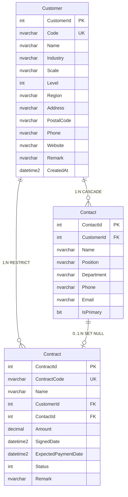

# ER草图 — 企业客户与合同管理系统 (CRM Lite)

> **绘制人**：黄陈熙（DDD领域建模师）| **日期**：2026年6月

---

## 实体关系图（Mermaid）

---

## 关系汇总

| 父实体 | 关系 | 子实体 | 外键字段 | 删除规则 | 业务含义 |
|--------|:----:|--------|----------|----------|----------|
| Customer | 1 : N | Contact | Contact.CustomerId | **CASCADE** | 删除客户 → 级联删除联系人 |
| Customer | 1 : N | Contract | Contract.CustomerId | **RESTRICT** | 有关联合同时禁止删除客户 |
| Contact | 0..1 : N | Contract | Contract.ContactId | **SET NULL** | 删除联系人 → 合同引用置空 |

---

## 高清版

见同目录下 `ER草图.png`（Python matplotlib 绘制，含完整字段、乌鸦脚符号、外键标注、图例）
