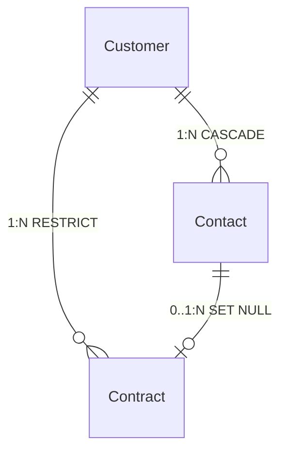

# 企业客户与合同管理系统（CRM Lite）

> **ASP.NET Core 网站开发课程设计**  
> 南京工业大学 计算机学院 | 信息管理与信息系统专业 大三  
> 实训时长：8天（集中实训）| 2026年6月

---

## 项目简介

本项目是一个**轻量级企业客户关系管理系统（CRM Lite）**，为某制造企业提供客户信息、联系人、合同及回款计划的统一管理平台，替代原有 Excel 台账，提高数据一致性和查询效率。

### 核心功能

- ✅ **客户管理** — 增删改查、搜索分页、行业/级别分类
- ✅ **联系人管理** — 增删改查、按客户筛选、主要联系人标记
- ✅ **合同管理** — 全生命周期管理、金额跟踪、回款计划、状态流转
- ✅ **下拉框联动** — 选择客户后动态加载关联联系人（AJAX）
- ✅ **双重验证** — 前端 jQuery Validation + 后端 Data Annotation
- ✅ **响应式布局** — Bootstrap 5 适配桌面/平板/手机

---

## 小组成员与角色

| 姓名 | 角色 | 职责 |
|------|:----|------|
| **刘子涵** | 项目经理 (PM) | 需求拆解、进度控制、Git 管理、报告统筹 |
| **黄陈熙** | 领域建模师 (DDD) | 领域分析、实体/值对象/聚合设计、ER 图 |
| **关张旭** | 前端开发 (Frontend) | Razor 页面、Bootstrap 5、jQuery Validation |
| **杨焱熙** | 后端开发 (Backend) | Code First 实体、DbContext、Migration、Controller |

---

## 技术栈

| 层次 | 技术 | 版本 |
|------|------|------|
| 框架 | ASP.NET Core | 7.0 |
| ORM | Entity Framework Core | 7.0 |
| 数据库 | SQL Server (LocalDB) | 2022 |
| 前端 | Bootstrap 5 + jQuery | 5.3 / 3.7 |
| 开发模式 | **Code First + Migration** | — |
| 架构思想 | **DDD（领域驱动设计）** | — |

---

## 项目结构

```
/
├── README.md                    # 本文件
├── 需求说明.md                  # 需求分析文档
├── 项目进度计划表.md            # 8天进度计划
├── 领域模型说明.md              # DDD 领域模型文档
├── ER草图.md                   # ER 图 (Mermaid)
├── ER草图.png                  # ER 图 (高清)
└── src/                        # 源代码（后续添加）
```

---

## 快速启动

```bash
# 1. 克隆仓库
git clone https://github.com/somnium-123/-.git
cd -

# 2. 后续步骤（Day 2 项目搭建后）
dotnet restore
dotnet ef database update
dotnet run
```

### 环境要求

- Visual Studio 2022 (17.x+)
- .NET 7.0 SDK
- SQL Server LocalDB 2022

---

## Git 协作规范

### 分支策略

```
main (主干，受保护)
 └── dev (开发分支)
```

### 每日提交要求

- **每人每天至少 1 次有效提交**
- Commit Message 格式：`<type>: <subject>`

| Type | 用途 | 示例 |
|------|------|------|
| `feat` | 新功能 | `feat: 完成 Customer 实体类` |
| `fix` | Bug 修复 | `fix: 修复合同保存异常` |
| `docs` | 文档 | `docs: 完成 DDD 领域模型设计` |
| `style` | 样式 | `style: 统一 Bootstrap 响应式` |
| `ui` | 前端页面 | `ui: 完成客户列表页` |
| `db` | 数据库 | `db: 初始化 Code First Migration` |
| `test` | 测试 | `test: 完成集成测试` |
| `chore` | 工具 | `chore: 初始化项目结构` |
| `release` | 发布 | `release: v1.0 最终版本` |

### 禁止行为

| 行为 | 处罚 |
|------|------|
| 0 次提交 | 个人成绩 ≤ 不及格 |
| 只改 README | 当日提交无效 |
| 共用 Git 账号 | 全组降档 |
| 删除 Git 历史 | 直接不及格 |

---

## 数据库实体关系



| 父表 | 关系 | 子表 | 删除规则 |
|------|:--:|------|----------|
| Customer | 1:N | Contact | CASCADE |
| Customer | 1:N | Contract | RESTRICT |
| Contact | 0..1:N | Contract | SET NULL |

---

## 8天进度

| 天次 | 主题 | 汇报 |
|:----:|------|:----:|
| Day 1 | 需求分析 + DDD 设计 | ▲ 汇报① |
| Day 2 | Code First 实体 + 数据库 | ▲ 汇报② |
| Day 3 | 客户 & 联系人模块 | — |
| Day 4 | 合同模块 + 联动 | ▲ 汇报③ |
| Day 5 | 验证 + 美化 | — |
| Day 6 | 集成测试 | ▲ 汇报④ |
| Day 7 | 报告撰写 | — |
| Day 8 | 演示答辩提交 | ▲ 终评 |

---

## 评分标准

| 考核维度 | 占比 |
|----------|:---:|
| 系统可运行性 | 35% |
| Code First 规范性 | 20% |
| 数据库设计质量 | 15% |
| 个人贡献度 | 15% |
| 文档与表达 | 15% |

---

> **信管2901-01组** — 刘子涵 · 黄陈熙 · 关张旭 · 杨焱熙  
> © 2026 南京工业大学 经济与管理学院
